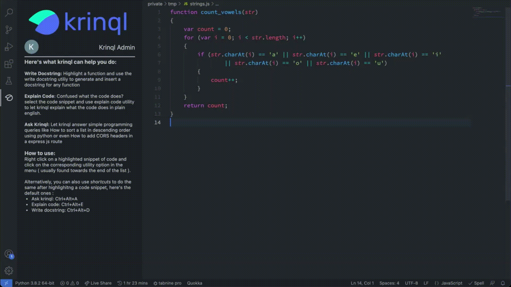
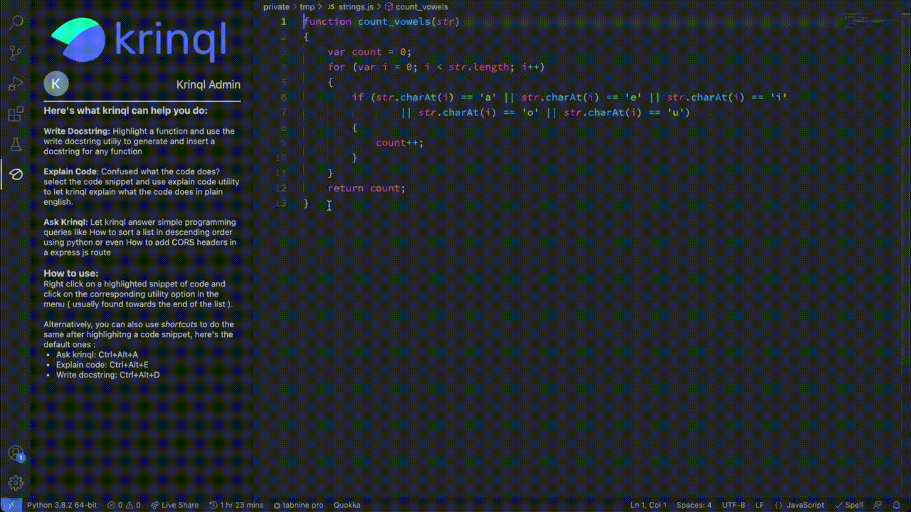
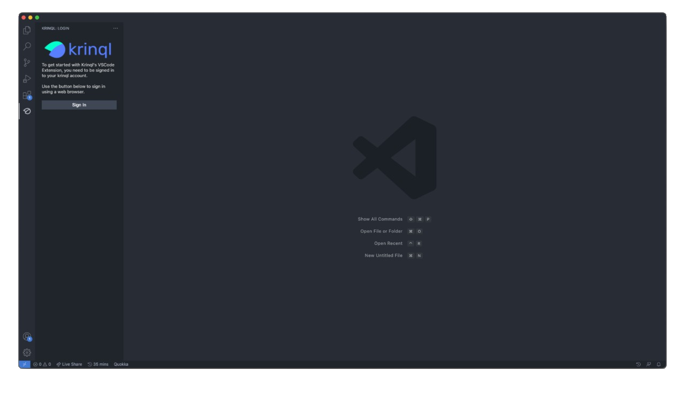

</a>


[Krinql](https://www.krinql.com/) allows you to write good code, super fast. It takes out the boring parts of writing code such as, writing docstrings, and even looking up how to use a library feature, and automates them with within the VS Code editor itself.

<p align="center">
  <a href="https://github.com/krinql/krinql-vscode/">
    </a>
  <a href="https://marketplace.visualstudio.com/items?itemName=Krinql.krinql-vscode">
    </a>
  <a href="https://marketplace.visualstudio.com/items?itemName=Krinql.krinql-vscode">
    
  </a>
</p>

## Features

<b>Ask Krinql</b>

Ask a question about the file you are working on, which Krinql will answer.



<b>Explain (entire) Code</b>

Highlight some code, and Krinql will generate comments which describe what the highlighted code is doing. 


<b>Generate Docstring</b>

Highlight some code, and Krinql will automatically generate and add docstrings to it.



## Installation

Install from the Visual Studio Code Marketplace or by clicking the link below:

[Visual Studio Code Marketplace: Krinql](https://marketplace.visualstudio.com/items?itemName=krinql.krinql-vscode)

To install directly from VS Code, press (Ctrl+P), and paste the following command. Then, press enter.
```
ext install krinql.krinql-vscode
```

## Before you use

Make sure to sign in by clicking the Krinql icon on the left bar of VS Code.



## Release Notes

<br>

### 0.0.1

Initial Beta - Explain Code, Generate Docstring, and Ask Krinql
